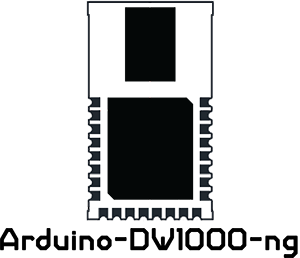

 

  

 

### Decawave의 [DW1000](https://www.decawave.com/product/dw1000-radio-ic/) IC와 관련 모듈을 사용하기 위한 Arduino 라이브러리입니다.

[**English**](../en/README.en.md) | [**한국어**](../kr/README.ko.md)

상태
------------
기존 [F-Army/arduino-dw1000-ng](https://github.com/F-Army/arduino-dw1000-ng)를 이어가고자, 포크를 한 레포지토리입니다.

thotro/arduino-dw1000와의 차이점
------------
이 프로젝트는 [thotro/arduino-dw1000](https://github.com/thotro/arduino-dw1000)의 포크입니다. 
포크의 주요 이유는 원작자가 더 이상 개발하지 않아서 개발 속도가 매우 느리기 때문이며, 중요한 기능(예: 안테나 지연 보정)이 부족했기 때문입니다. 
또한 우리는 거리 측정 로직의 작동 방식을 변경하고자 했습니다. 
거리 측정 루프를 제공하는 대신, 사용자가 프로그램을 더 많이 제어할 수 있도록 다양한 이중 거리 측정 흐름 프레임을 전송하는 기능을 제공하고자 했습니다. 
기본 드라이버도 많은 부분에서 다시 작성하여 모든 API 함수가 서로 독립적이 되도록 했습니다.
우리는 또한 프로젝트를 빠르게 해킹할 수 있는 매우 고수준의 추상화를 만들 계획입니다.

기능
------------

-test-orange.svg?&style=for-the-badge)

 

장치
------------

특정 테스트 장치 및 관련 핀아웃은 [Wiki](https://github.com/F-Army/arduino-dw1000-ng/wiki/Tested-hardware-boards)에서 확인할 수 있습니다.

설치
------------
**C++11 지원 필요**, Arduino IDE >= 1.6.6은 C++11을 지원합니다.

 1. 마스터 브랜치 또는 최신 릴리스의 ZIP 파일을 받아 컴퓨터에 저장합니다.
 2. Arduino IDE를 열고 _Sketch_ -> _Include Library_ -> _Add .ZIP Library..._로 이동합니다.
 3. 다운로드한 DW1000 라이브러리의 ZIP 파일을 선택합니다.
 4. 이제 라이브러리를 목록에서 볼 수 있으며, IDE의 전용 섹션에서 예제에 액세스할 수 있습니다.

사용법
-----
기본 사용법은 예제 폴더를 확인하세요.

[Decawave 문서](https://github.com/F-Army/arduino-dw1000-ng/wiki/Decawave's-documentation)는 이 프로젝트를 이해하는 데 큰 도움이 됩니다, 특히 더 깊이 들어가고 싶을 때 유용합니다.

저자
------------
<ul>
  <li><b>Michele 'an4cr0n' Biondi </b>: https://github.com/an4cr0n</li>
  <li><b>Andrea 'Sonic0' Salvatori</b>: https://github.com/Sonic0</li>
</ul>

라이선스
-------
이 프로젝트는 MIT 라이선스 하에 있습니다 (자세한 내용은 [LICENSE.md](https://github.com/F-Army/arduino-dw1000Ng/blob/master/LICENSE.md) 참조)  
일부 파일은 [thotro/arduino-dw1000](https://github.com/thotro/arduino-dw1000)의 포크이기 때문에 Dual Apache 2.0/MIT 라이선스 하에 있습니다.
